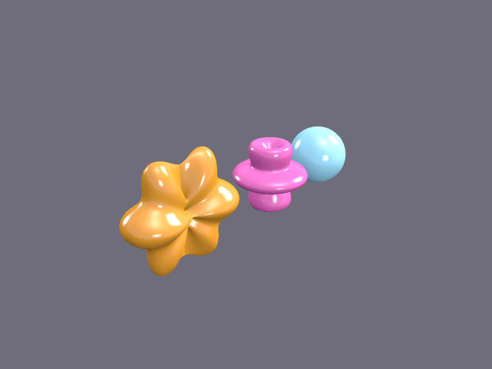
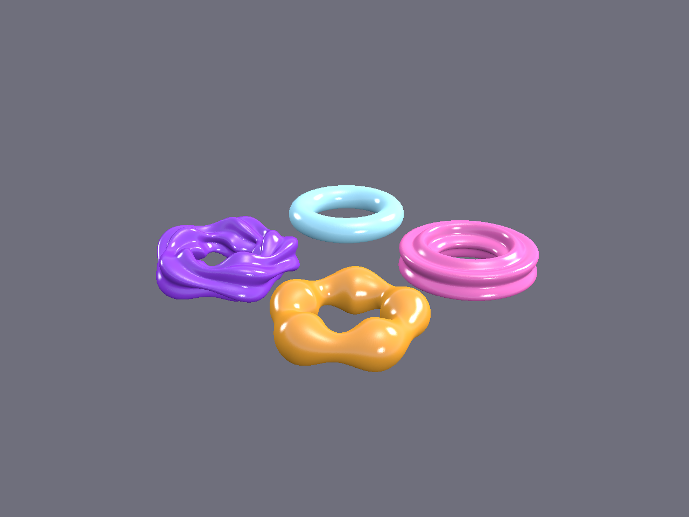
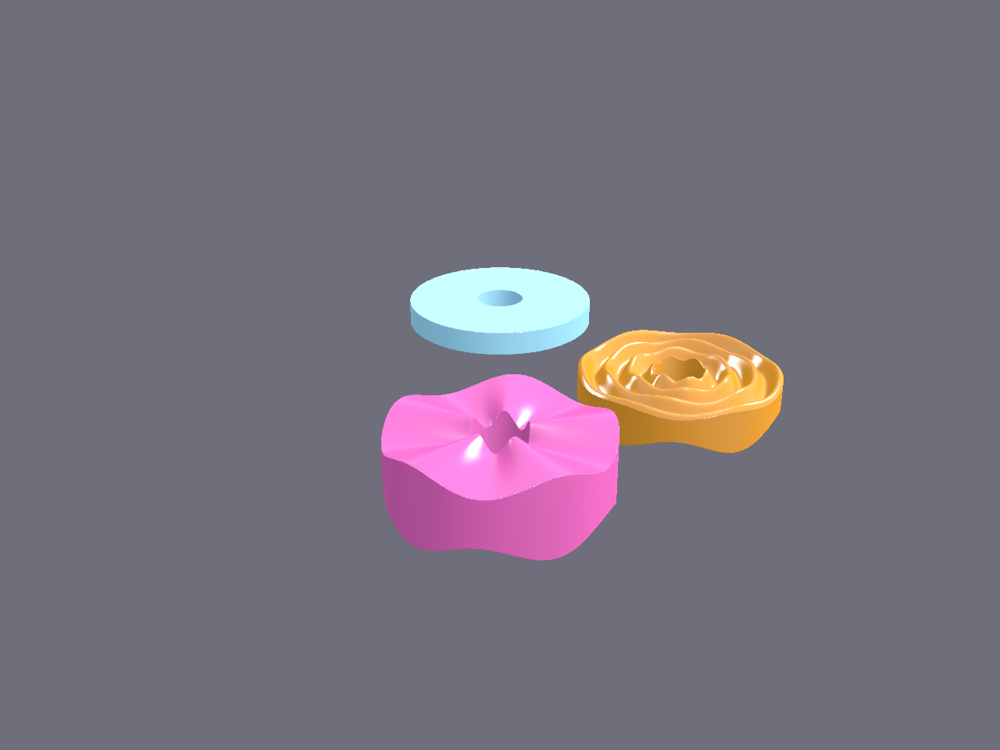
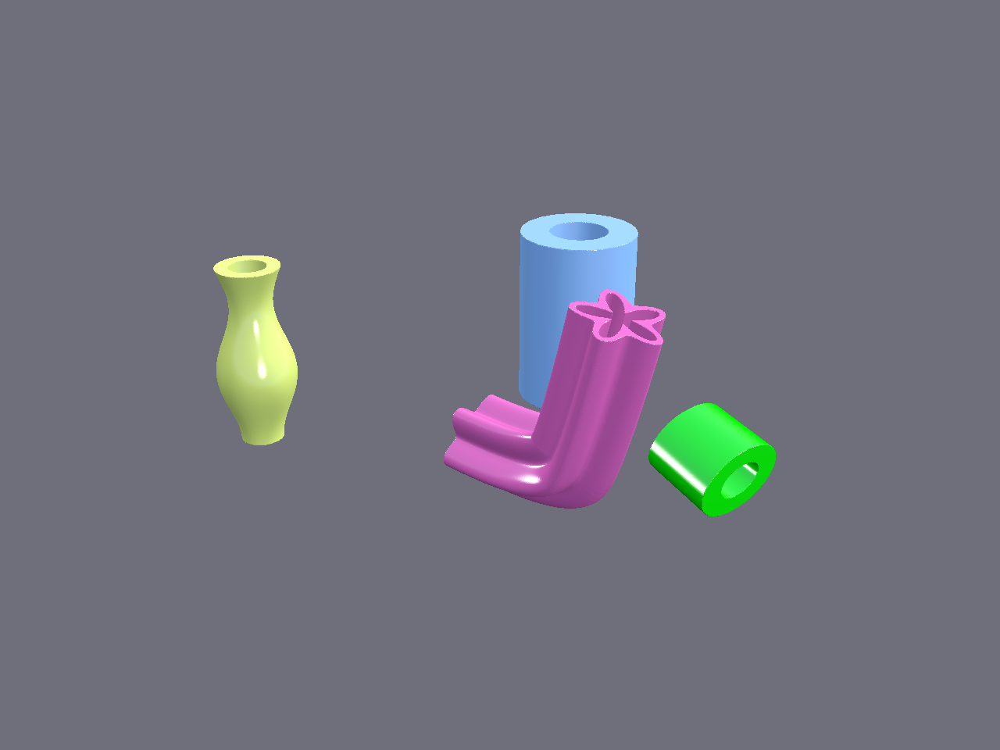
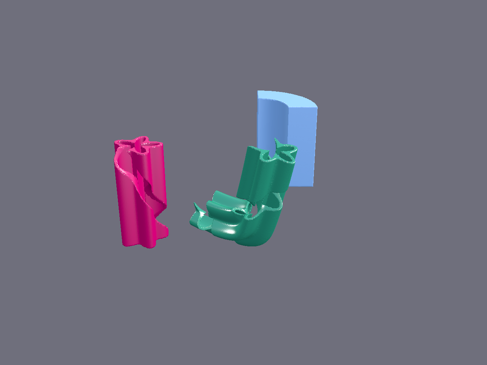
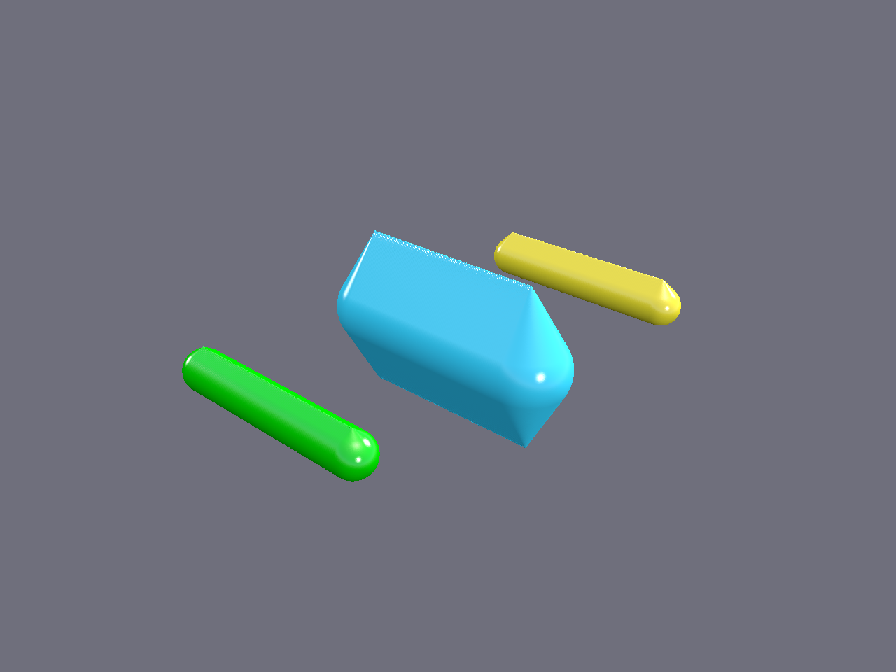
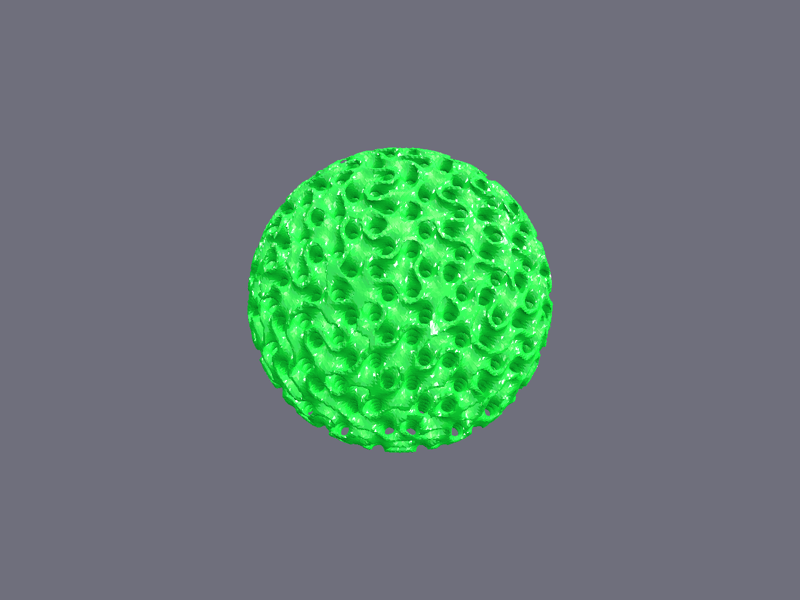
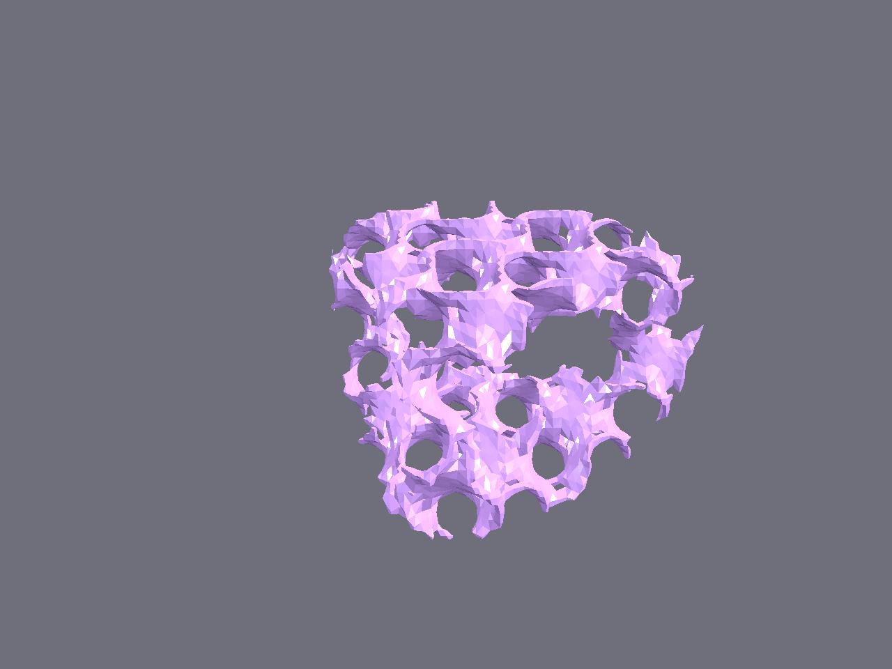
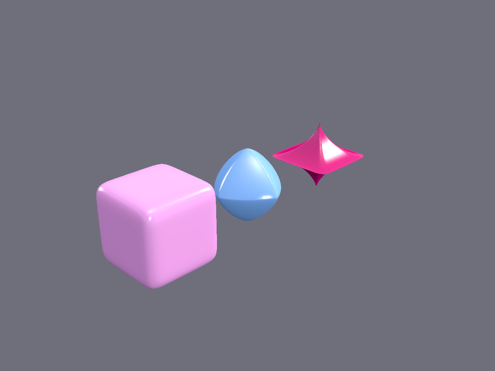
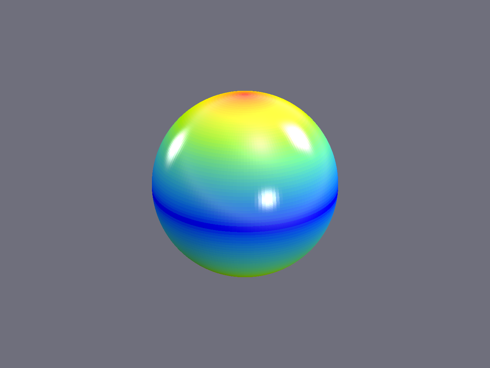

# Gallery

A selection of shapes built with [`picopie.shapes`](tutorials/shapes/01-parametric-shapes.md)
and rendered with `render_png` / the interactive viewer. Every image is produced
by the runnable [`examples/shapekernel/gallery.py`](https://github.com/Borderliner/PicoPie/blob/main/examples/shapekernel/gallery.py)
(a port of LEAP 71's ShapeKernel examples):

```bash
python examples/shapekernel/gallery.py out_dir   # render every scene (needs a display)
python examples/shapekernel/gallery.py --show sphere
```

## Base shapes

| Sphere (modulated radii) | Ring (modulated tube) | Lens (curved profiles) |
|---|---|---|
|  |  |  |

## Pipes & segments

| Pipe (transformed + modulated) | Pipe segments (angular slices) |
|---|---|
|  |  |

## Lattices & implicits

| Lattice manifold (printable tips) | Gyroid sphere | Gyroid genus |
|---|---|---|
|  |  |  |

## Implicits & painter

| Super-ellipsoids | Mesh painter (overhang angle) |
|---|---|
|  |  |
